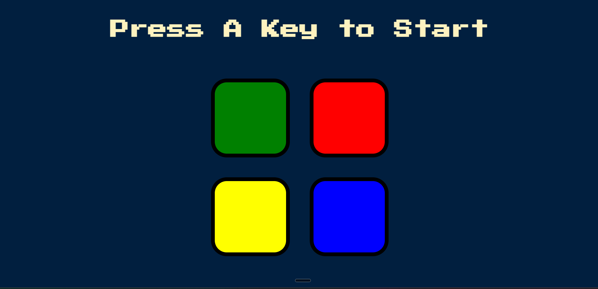

# Simon Game

A responsive browser-based implementation of the classic **Simon memory game**, built with HTML, CSS, JavaScript, and jQuery.

The project was developed as a learning project while following Angela Yu's Web Development course, with additional focus on responsive styling, code organization, documentation, and Git/GitHub workflow.

## Live Demo

**[Play Simon Game](https://shadowmask86.github.io/simon-game/)**

## Preview



## About the Project

Simon is a memory game in which the player must reproduce an increasingly long sequence of colored buttons.

The game generates a random color sequence one step at a time. The player watches the sequence, then reproduces it by clicking the corresponding buttons in the correct order.

A correct sequence advances the game to the next level. Selecting the wrong color ends the current game and allows the player to restart.

## Features

- Randomly generated color sequences
- Progressive level system
- Player input tracking and sequence validation
- Sound effects for each color
- Visual button-press animations
- Game-over visual feedback
- Restart functionality
- Responsive layout for smaller screens
- Mobile-friendly button sizing
- Clean separation of HTML, CSS, and JavaScript responsibilities
- Concise code comments and documentation

## Technologies Used

- **HTML5** — page structure and game interface
- **CSS3** — styling, layout, animations, and responsive design
- **JavaScript** — game logic and state management
- **jQuery 3.7.1** — DOM manipulation and event handling
- **Google Fonts** — Press Start 2P font
- **Git & GitHub** — version control and project hosting
- **GitHub Pages** — live deployment

## How to Play

1. Open the [live game](https://shadowmask86.github.io/simon-game/).
2. Press any keyboard key to start the game.
3. Watch the button that lights up and listen to its sound.
4. Click the same button to reproduce the sequence.
5. Each successful round adds one more color to the sequence.
6. Continue reproducing the sequence as the level increases.
7. If you select the wrong button, the game ends.
8. Press any keyboard key to start a new game.

### Game Flow

```text
Press any key
      ↓
Generate a random color
      ↓
Show color + play sound
      ↓
Player repeats the sequence
      ↓
Is the answer correct?
   ↙           ↘
 Yes            No
  ↓              ↓
Complete       Game Over
sequence?         ↓
  ↓           Press any key
 Yes          to restart
  ↓
Next level
```

## Getting Started

### Prerequisites

No build tools or package installation are required.

You only need:

- A modern web browser
- Git, if you want to clone the repository

### Run Locally

Clone the repository:

```bash
git clone https://github.com/ShadowMask86/simon-game.git
```

Navigate into the project:

```bash
cd simon-game
```

Open `index.html` in your browser.

Alternatively, use the **Live Server** extension in VS Code for local development.

## Project Structure

```text
simon-game/
├── assets/
│   └── screenshot.png
├── sounds/
│   ├── blue.mp3
│   ├── green.mp3
│   ├── red.mp3
│   ├── wrong.mp3
│   └── yellow.mp3
├── .gitignore
├── game.js
├── index.html
├── styles.css
└── README.md
```

### File Responsibilities

| File / Directory | Purpose |
|---|---|
| `index.html` | Defines the game interface and loads the required resources |
| `styles.css` | Controls the visual design, layout, and responsive behavior |
| `game.js` | Contains the game logic, sequence generation, validation, sounds, and restart logic |
| `sounds/` | Stores the game's audio feedback files |
| `assets/` | Stores project assets such as the README screenshot |
| `.gitignore` | Specifies files Git should ignore |
| `README.md` | Documents the project and how to use it |

## Game Logic Overview

The JavaScript is organized around separate responsibilities:

### `nextSequence()`

Generates the next random color, adds it to the game sequence, plays the corresponding sound, animates the button, and updates the level.

### `playSound(name)`

Creates and plays the audio file associated with a particular color or game state.

### `pressAnimation(currentColour)`

Temporarily applies the `pressed` CSS class to provide visual feedback when a button is activated.

### `checkAnswer(currentIndex)`

Compares the player's latest input with the corresponding item in the generated game sequence.

If the complete sequence is correct, the game proceeds to the next level.

### `startOver()`

Resets the game state after an incorrect answer so that a new game can begin.

## Responsive Design

The interface uses CSS responsive techniques such as:

- `clamp()` for flexible sizing
- Flexbox for button layout
- Media queries for smaller screens
- Responsive button dimensions
- A constrained game-board width
- Viewport-aware typography

This allows the game interface to adapt to different screen sizes while maintaining the two-by-two button layout.

## What I Learned

This project helped reinforce several web-development concepts:

- Structuring a web page with semantic HTML
- Styling interfaces with CSS and Flexbox
- Building responsive layouts with media queries
- Using JavaScript arrays to manage game sequences
- Generating random values
- Handling keyboard and mouse events
- Using functions to separate responsibilities
- Working with JavaScript state
- Using jQuery for DOM manipulation and event handling
- Working with audio in the browser
- Using `setTimeout()` for timed UI behavior
- Debugging browser-based JavaScript
- Refactoring code for readability and maintainability
- Writing useful code comments and project documentation
- Using Git commits to track meaningful project changes
- Publishing a project with GitHub Pages

## Future Improvements

Possible future enhancements include:

- Add a visible score/high-score system
- Add a dedicated start/restart button for improved accessibility
- Improve accessibility with keyboard-operable game buttons
- Add more polished transition animations
- Add difficulty modes
- Store the highest score using `localStorage`
- Add additional visual themes
- Improve audio handling and feedback
- Add automated tests for the game logic

## Credits

- Project concept and learning reference: **Angela Yu's Web Development course**
- Font: **Press Start 2P** via Google Fonts
- jQuery: **jQuery 3.7.1**

## Author

**Shreyash**

GitHub: **[ShadowMask86](https://github.com/ShadowMask86)**

---

If you enjoyed the project, feel free to explore the repository and try the game.
